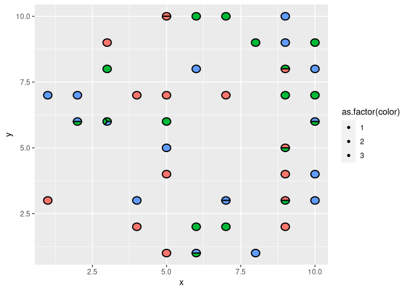

<!-- README.md is generated from README.Rmd. Please edit that file -->

# ggpizza

<!-- badges: start -->

[](https://lifecycle.r-lib.org/articles/stages.html#experimental)
<!-- badges: end -->

The goal of ggpizza is to …

## Installation

You can install the development version of `ggpizza` like so:

``` r
#install.packages('devtools')
devtools::install_github('turtletopia/ggpizza')
```

## Example

This is a basic example which shows you how to solve a common problem:

``` r
library(ggpizza)
library(ggplot2)

set.seed(123)
some_random_data <- data.frame(x = sample(1:10, 50, TRUE), 
                               y = sample(1:10, 50, TRUE),
                               color = sample(1:3, 50, TRUE))
some_random_data
#>     x  y color
#> 1   3  8     2
#> 2   3  6     2
#> 3  10  6     3
#> 4   2  7     3
#> 5   6  1     3
#> 6   5  6     2
#> 7   4  2     1
#> 8   6  1     2
#> 9   9  2     1
#> 10 10  4     3
#> 11  5  5     3
#> 12  3  6     2
#> 13  9  3     1
#> 14  9  9     3
#> 15  9  4     1
#> 16  3  6     3
#> 17  8  9     2
#> 18 10  9     2
#> 19  7  7     1
#> 20 10  3     3
#> 21  9  8     2
#> 22  3  9     1
#> 23  4  3     3
#> 24  1  7     3
#> 25  7  3     3
#> 26  5  7     1
#> 27 10  6     2
#> 28  7 10     2
#> 29  9  5     1
#> 30  9  5     2
#> 31 10  8     3
#> 32  7  3     3
#> 33  5 10     1
#> 34  7  2     2
#> 35  5 10     1
#> 36  6  2     2
#> 37  9 10     3
#> 38  2  6     3
#> 39  5  4     1
#> 40  8  1     3
#> 41  2  6     2
#> 42  1  3     1
#> 43  9  8     1
#> 44  9  3     2
#> 45  6  8     3
#> 46  5  1     1
#> 47  9  7     2
#> 48 10  7     2
#> 49  4  7     1
#> 50  6 10     2
```

``` r
ggplot(some_random_data, aes(x, y, color = as.factor(color))) +
  geom_point_pizza(size = 3)
```


